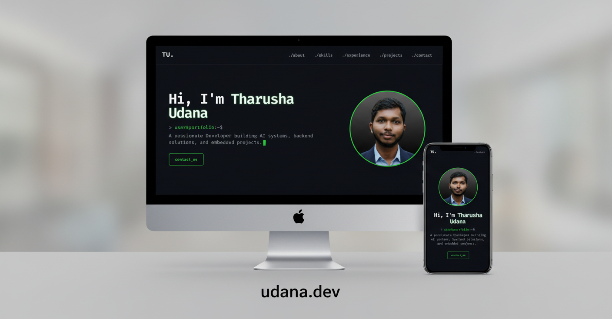

# Personal Portfolio - [udana.dev](https://udana.dev)

This is my personal **portfolio website** built with **Next.js (static export)**.  
It features a **unique terminal-inspired interface** that represents my style as a developer.  

## 🔗 Live Website
👉 [Portfolio: udana.dev](https://udana.dev)

## ✨ Features
- ⚡ Built with **Next.js** (Static Generation)
- 🖥️ **Terminal-like UI** for a unique experience
- 📱 Fully **responsive** across devices
- 🚀 Optimized for **fast performance**
- 🌐 Hosted on **udana.dev**

## 🛠️ Tech Stack
- **Framework:** Next.js
- **Styling:** Tailwind CSS
- **Deployment:** Vercel / Custom Hosting (udana.dev)

## 📂 Project Setup
To run locally:

```bash
# Clone repository
git clone https://github.com/tharushaudana/My-Portfolio.git

# Go into project directory
cd portfolio

# Install dependencies
npm install

# Run development server
npm run dev
````

Open [http://localhost:3000](http://localhost:3000) to view it in your browser.

## 📦 Build

```bash
# Build static site
npm run build
npm run export
```

## 📸 Preview



---

### 🧑‍💻 About Me

I’m **Tharusha Udana**, a developer passionate about **Backend Development, Embedded Systems, AI, and IoT**.
Check out my work at 👉 [udana.dev](https://udana.dev)